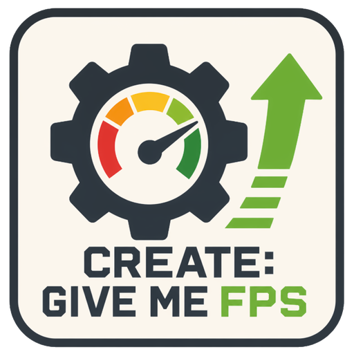

# Create: Give Me FPS

[Русская версия](README_RU.md) | English

<p align="center">
  
</p>

**Create: Give Me FPS** is a client-side optimisation and diagnostics mod for
large **Create** factories. It gives players direct control over expensive
visual effects—mechanism animations, conveyor-belt items, particles, and the
Flywheel renderer—without changing the factory itself.

Target platform: **Minecraft Java 1.21.1 · NeoForge · Create 6.0.10 · Flywheel
1.0.6 · Java 21**.

> The mod changes client visuals only. Recipes, inventories, kinetic stress,
> machine behaviour, saved worlds, and server-side simulation remain intact.

## What the mod does

Open the mod's configuration screen from Minecraft's Mods menu. Choose a
ready-made graphics profile or configure individual visual systems. The
settings are stored locally for the client.

### Graphics profiles

Six profiles provide a quick starting point:

| Profile | Intended use |
| --- | --- |
| Potato | Maximum FPS; disables or aggressively reduces costly visuals. |
| Low | Low-end hardware or very dense factories. |
| Medium | A balanced everyday configuration. |
| Above Average | More visual detail with moderate limits. |
| High | Quality-first settings for typical Create worlds. |
| Ultra | Minimal visual reduction. |

Profiles can be changed at any time. Manual adjustments switch the active
profile to Custom, so a chosen option is never silently lost.

### Mechanism animations

Create mechanisms can be especially expensive when a factory contains many
shafts, gears, belts, moving parts, and kinetic block entities. The mod offers:

- one master switch for supported Create mechanism animations;
- a searchable **individual mechanisms** screen with separate groups, such as
  shafts/gears, belts, flywheels, hand cranks, crushing wheels, fans,
  contraptions, and supported processing machinery;
- full-animation distance from **0 to 32 blocks** — `0` means that the full
  animated version is never rendered;
- distant-animation behaviour: keep it, reduce it, or leave it static;
- an animation-update frequency for simplified distant visuals.

The mechanisms continue to work. These controls change only how supported
client render paths are updated and drawn.

### Belts and item rendering

Large item transport systems can overload the renderer even when shadows are
disabled. Belt controls let you choose whether to show:

- items travelling on supported conveyor belts;
- shadows cast by belt items;
- loose item output around crushing wheels;
- optimised distant item shadows.

This is useful for sorting systems and bulk processing where thousands of
stacks are visible at once.

### Particles and fluid effects

The Particles page controls selected visual effects from Create and fluids:

- Full, Reduced, or Off Create particle mode;
- separate limits for steam/smoke, sparks, item and block-break effects, and
  water/lava splashes;
- supported direct filtering for Create fluid-effect paths, including
  hose-related effects.

The controls do not change fluid transfer or machine logic. Some effects may
still be produced by vanilla Minecraft, another mod, or a Create path that is
not supported by the installed version; the mod reports this instead of
claiming to block every possible particle.

### Flywheel and shaders

The Flywheel page exposes renderer choices normally hidden in configuration:

- **Default** — use Create/Flywheel's normal backend choice;
- **Indirect** — use Flywheel's indirect rendering path;
- **Instancing** — use instance-based rendering where compatible;
- **Off** — disable Flywheel rendering integration;
- **Accelerated Rendering** — optional optimisation adapted from
  [CreateBetterFPS](https://github.com/MoePus/CreateBetterFPS), available when
  Sodium and Iris are both installed.

Changing the Flywheel backend or Accelerated Rendering requires a **full game
restart**. The menu marks this requirement whenever the saved choice differs
from the one currently active in the game.

### Developer Mode and local reports

Developer Mode helps identify the visual situation at the place where FPS
drops, rather than guessing from a paused menu. It provides:

- **Start recording** — creates a timestamped report session immediately;
- **Save report** — writes a snapshot at the current position;
- **Stop and save** — writes the final snapshot and ends recording;
- optional automatic captures on frame-time spikes;
- nearby-scene estimates for Create block entities, kinetic blocks, belts,
  chain conveyors, contraptions, and common mechanism families;
- frame-time, FPS, 1% low, particle, and detected rendering-path data.

Reports are stored locally in `logs/GMF/<date-time>/`. They are not telemetry
and are never uploaded by the mod. Scene counts help focus testing; they are
not a replacement for a full CPU/GPU profiler.

## Requirements

| Component | Required version |
| --- | --- |
| Minecraft | 1.21.1 |
| Loader | NeoForge 21.1.x |
| Create | 6.0.10 |
| Flywheel | 1.0.6 |
| Java | 21 |

The mod is client-side. A server does not need it, but all mods installed in a
pack still need mutually compatible versions.

## Installation

1. Install NeoForge, Create, and Flywheel for Minecraft 1.21.1.
2. Download `Create-Give-Me-FPS-0.1.2-NeoForge-1.21.1.jar` from
   [Releases](../../releases).
3. Put the JAR into the instance's `mods` directory.
4. Open Minecraft's Mods menu and select **Create: Give Me FPS** to configure
   the client.

## Important limitations

- This mod does not add low-poly Create models, terrain LOD, or lower-resolution
  textures.
- Create, Flywheel, shaders, and addon mods do not all use one render hook.
  Disabling a supported group reduces its covered rendering path, but cannot
  guarantee that a third-party effect disappears.
- An FPS result is meaningful only when compared from the same location, camera
  angle, render distance, resolution, shader pack, and factory state.
- If another optimisation mod implements the same Create/Flywheel feature,
  avoid enabling duplicate controls at the same time.

## Build from source

```powershell
.\gradlew.bat clean test build
```

The development JAR is created in `build/libs/`.

## Credits and licence

The optional Accelerated Rendering feature is adapted from
[CreateBetterFPS](https://github.com/MoePus/CreateBetterFPS) by MoePus under
the MIT License. See [THIRD_PARTY_NOTICES.md](THIRD_PARTY_NOTICES.md) and the
preserved [original notice](THIRD_PARTY_LICENSES/CreateBetterFPS-MIT.txt).

This project is released under the [MIT License](LICENSE).
